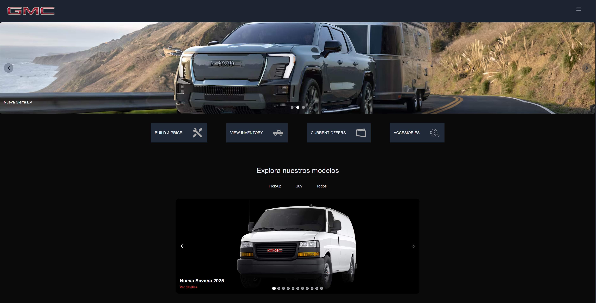

# 🚗 Concesionaria GMC

Este proyecto es una **concesionaria de autos ficticia**, desarrollado como un e-commerce moderno.
Incluye funcionalidades como autenticación, visualización de productos y un sistema de **checkout** para simular la compra de vehículos.

## 🔧 Tecnologías utilizadas

* [Next.js](https://nextjs.org/) – Framework de React.
* [Firebase](https://firebase.google.com/) – Autenticación y base de datos en tiempo real
* [Tailwind CSS](https://tailwindcss.com/) – Utilidades de CSS para un diseño responsive y elegante

## ✨ Funcionalidades

* 🛒 Agregar productos al carrito
* ✅ Proceso de checkout simulado
* 🔐 Login mediante [Firebase Auth](https://firebase.google.com/products/auth)
* ⚡ Moderno y responsive gracias a Tailwind

## 🚀 Deploy

La aplicación está desplegada en Vercel:
 [**Link al sitio**](https://proyecto-gmc.vercel.app) ← *\[Reemplazá esto con tu URL]*

## 🖼️ Captura de pantalla

> Asegurate de agregar tu screenshot en la carpeta `/public` y reemplazar el nombre en el link.



## 🛠️ Instalación local

1. Cloná el repositorio:

   ```bash
   git clone https://github.com/tuusuario/nombre-repo.git
   cd nombre-repo
   ```

2. Instalá dependencias:

   ```bash
   npm install
   ```

3. Crea un archivo `.env.local` con tus claves de Firebase:

   ```env
   NEXT_PUBLIC_APIKEY=tu_api_key
   NEXT_PUBLIC_AUTHDOMAIN=tu_auth_domain
   NEXT_PUBLIC_PROJECTID=tu_project_id
   NEXT_PUBLIC_STORAGEBUCKET=tu_storage_bucket
   NEXT_PUBLIC_MESSAGINGSENDERID=tu_sender_id
   NEXT_PUBLIC_APPID=tu_app_id
   ```

4. Iniciá el servidor de desarrollo:

   ```bash
   npm run dev
   ```

💻 Hecho por Augusto2343
